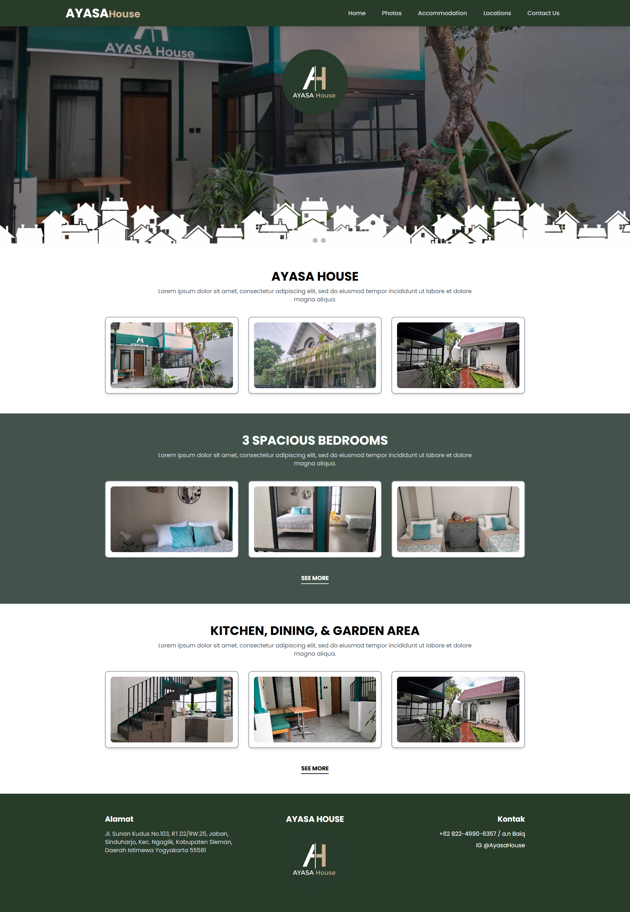
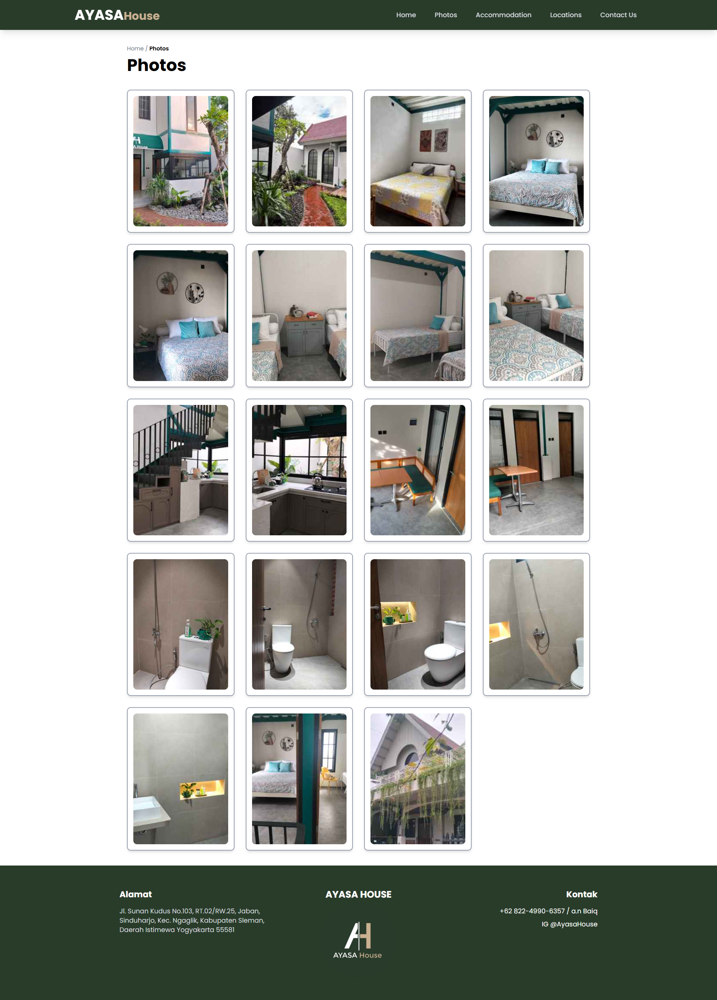
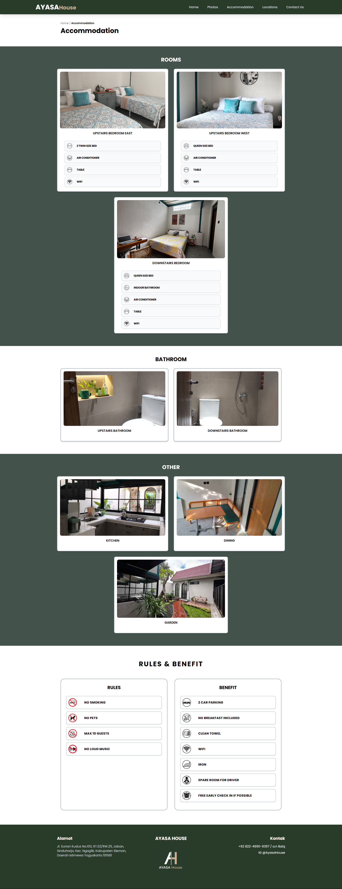
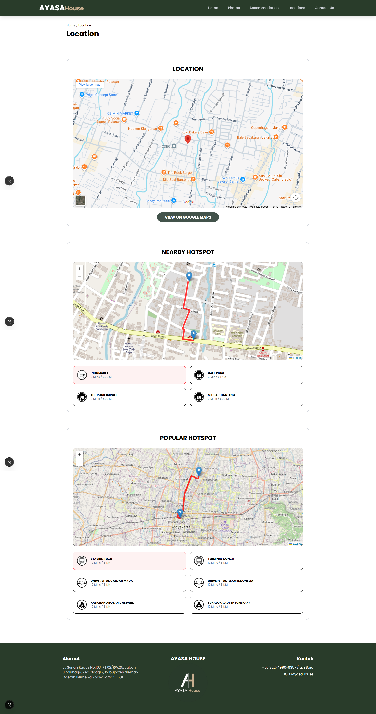

# 🏠 AYASA House - Homestay Information Platform

AYASA House is a responsive web application that serves as a digital catalog and information platform for the **AYASA House** homestay located in Sleman, Special Region of Yogyakarta. This website is designed to provide prospective guests with an immersive visual experience regarding facilities, location, and accommodation details.

---

## 📑 Images

---

## ✨ Key Features
* **Interactive Visual Presentation:** Displays a high-quality photo gallery covering both the exterior and interior of the building.
* **Location Navigation System:** Digital map integration to show precise location points and nearby popular landmarks.
* **Complete Accommodation Details:** Specific information regarding room types, bathroom facilities, and communal areas.
* **Policy Information (Rules & Benefits):** Dedicated panels explaining stay regulations and guest advantages.
* **Responsive Design:** A modern interface with a forest green and white color scheme that evokes a sense of tranquility.

---

## 🖼️ Page Structure
1.  **Home:** Main visual summary and property introduction.
2.  **Photos:** A complete gallery detailing every corner of the property.
3.  **Accommodation:** Detailed facilities per room (bedrooms, kitchen, dining area).
4.  **Locations:** An interactive page showing travel distances to popular locations in Yogyakarta.
5.  **Contact Us:** Direct contact information for reservations.

---

## 🛌 Accommodation Details
Based on the dashboard information:
* **Upstairs Bedrooms:** Available options for Twin Beds and Queen Beds with AC facilities.
* **Downstairs Bedroom:** Available room with a Queen Bed and AC.
* **Other Facilities:** Bathrooms (upstairs & downstairs), fully equipped kitchen, dining area, and a lush garden.

---

## 📍 Location & Accessibility
Ayasa House is strategically located in Sleman with quick access to various places:
* **Popular (12-17 Minutes):** Tugu Station, Gadjah Mada University (UGM), Islamic University of Indonesia (UII), and Kaliurang Botanical Park.
* **Nearby (2-7 Minutes):** Indomaret, Cafe Pidari, The Rock Burger, and Mie Sapi Banteng.

---

## 📋 Rules & Benefits
### **Rules:**
* No smoking indoors.
* No pets allowed.
* No drugs.
* No loud noises/disturbances.

### **Benefits:**
* Strategic location near the city.
* Quiet & clean environment.
* WiFi and drinking water facilities available.
* Parking available (2 car max).

---

## 🛠 Tech Stack
* **Framework:** Next.js / React.js.
* **Styling:** Tailwind CSS.
* **Deployment:** Vercel.
* **Maps:** Google Maps API / Leaflet.

---

## 📞 Contact & Reservation
- **Address:** Jl. Sunan Kudus No. 103, Sinduharjo, Kec. Ngaglik, Kabupaten Sleman, DIY 55581.
- **WhatsApp:** +62 822-4990-6357 (attn. Baiq).
- **Instagram:** [@AyasaHouse](https://www.instagram.com/AyasaHouse).

---
*Developed for Ayasa House - Yogyakarta*
